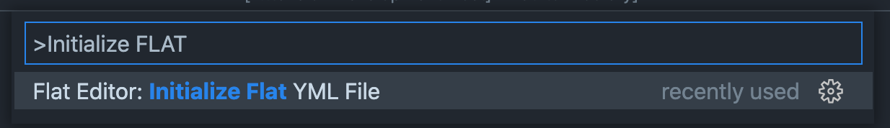
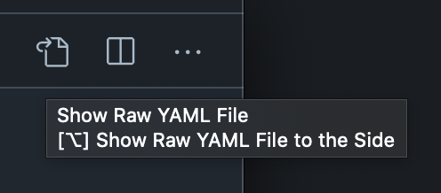
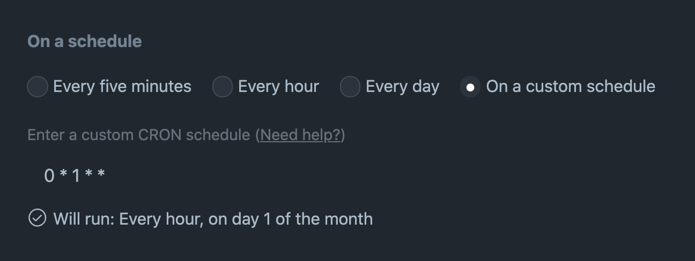
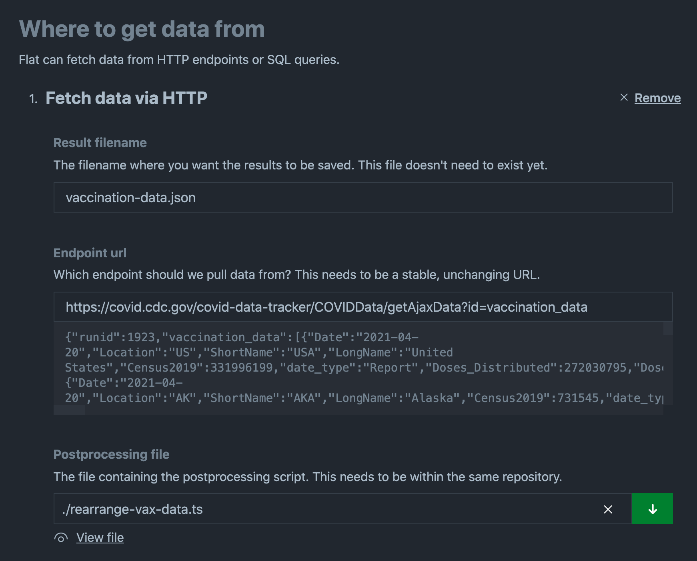

# Flat Editor VSCode Extension

<p>
  
</p>

👉🏽 👉🏽 👉🏽 **Full writeup**: [Flat Data Project](https://octo.github.com/projects/flat-data) 👈🏽 👈🏽 👈🏽

Flat Editor is a VSCode extension that steps you through the process of creating a [Flat Data Action](https://github.com/githubocto/flat), which makes it easy to fetch data and commit it to your repository.

Flat Data is a GitHub action which makes it easy to fetch data and commit it to your repository as flatfiles. The action is intended to be run on a schedule, retrieving data from any supported target and creating a commit if there is any change to the fetched data. Flat Data builds on the [“git scraping” approach pioneered by Simon Willison](https://simonwillison.net/2020/Oct/9/git-scraping/) to offer a simple pattern for bringing working datasets into your repositories and versioning them, because developing against local datasets is faster and easier than working with data over the wire.

## Usage

### VSCode

To use Flat Editor, first [install the extension](https://marketplace.visualstudio.com/items?itemName=githubocto.flat).

If you're starting from an empty repository, invoke the VSCode Command Palette via the shortcut <kbd>Cmd</kbd>+<kbd>Shift</kbd>+<kbd>P</kbd> and select **Initialize Flat YML File**



This will generate a `flat.yml` file in the `.github/workflows` directory, and will open a GUI through which you can configure your Flat action.


At any given time, you can view the raw content of the underlying YML file via the **View the raw YAML** button in the GUI, or via the following button at the top right of your VSCode workspace.



Changes to `flat.yml` are saved automatically when using the GUI, but feel free to save manually via <kbd>Cmd</kbd>+<kbd>S</kbd> if the habit is as deeply engrained for you as it is for us 😀

## Action Configuration

Currently, Flat supports the ingestion of data via the two following sources:

1. Publicly accessible HTTP endpoint
2. SQL Database (accessible via connection string)

Flat assumes that you'd like to run your workflow on a given schedule, and to that end exposes a GUI for specifying a CRON job as part of the action definition. We've selected a handful of default values, but feel free to enter any valid CRON string here. We'll even validate the CRON for you as you type!



### Creating an HTTP action



To create an HTTP action, you'll be asked for the following inputs:

1. A result filename (the filename and extension that your results will be written to, e.g., `vaccination-data.json`).
2. A publicly accessible URL (we'll try to render a helpful inline preview of the response from this endpoint if we can)
3. An optional path to a [postprocessing script](https://github.com/githubocto/flat#postprocessing), if you wish to perform further transformation or work on the fetched date

### Creating a SQL action


To create a SQL action, you'll be asked for the following inputs:

1. A result filename (the filename and extension that your results will be written to, e.g., `vaccination-data.json`).
2. A path to a SQL query
3. A database connection string <span style="color: red;">\*</span>
4. An optional path to a [postprocessing script](https://github.com/githubocto/flat#postprocessing), if you wish to perform further transformation or work on the fetched date

<span style="color: red;">\*</span> Note that we will encrypt this value and create a [GitHub secret](https://docs.github.com/en/actions/reference/encrypted-secrets) in your repository for this connection string. No sensitive data will be committed to your repository. Keep in mind that your repository must have an upstream remote on github.com in order for us to create the secret.

## Running Your Action

After you've added the requisite steps to your Flat action, push your changes to your GitHub repository. Your workflow should run automatically. Additionally, under the hood, the extension lists your optional postprocessing and/or SQL query files as workflow triggers, meaning the workflow will run anytime these files change. You can run your workflows manually, too, thanks to the `workflow_dispatch: {}` value that the extension adds to your Flat action.

```yaml
workflow_dispatch: {}
push:
  paths:
    - .github/workflows/flat.yml
    - ./rearrange-vax-data.ts
```

## Development and Deployment

Deploy a new version with:

First make sure you're a part of the githubocto marketplace team [here](https://marketplace.visualstudio.com/manage/publishers/githubocto).

1. Bump the version in package.json
2. Get a PAT [here](https://dev.azure.com/githubocto/_usersSettings/tokens) (first time)
3. `vsce login githubocto` (first time)
4. `vsce publish [minor|major|patch]`

## Issues

If you run into any trouble or have questions, feel free to [open an issue](https://github.com/githubocto/flat-editor/issues). Sharing your `flat.yml` with us in the issue will help us understand what might be happening.

❤️ GitHub OCTO

## License

[MIT](LICENSE)
