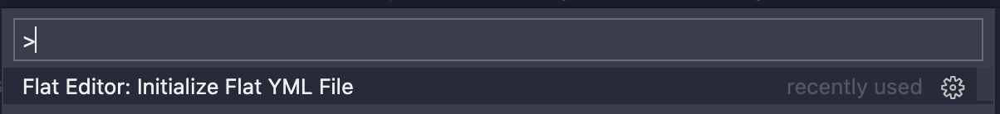

# Flat

  

Flat is a VSCode extension that steps you through the process of creating a [Flat action](https://github.com/githubocto/flat), which makes it easy to fetch data and commit it to your repository as flatfiles.

Just as [materialized views](https://en.wikipedia.org/wiki/Materialized_view) make it easier and faster to work the results of a query, Flat makes it easy to materialize data from anywhere into your workspace.

Flat streamlines a pattern popularized by [Simon Willison](https://simonwillison.net/2020/Oct/9/git-scraping/) and [Alex Gaynor](https://github.com/alex/nyt-2020-election-scraper)). The pattern of pulling data into git is an interesting one that deserves a dead-simple developer experience. Flat is an experiment from [GitHub's Office of the CTO](https://octo.github.com) to make it easier for anyone to employ this pattern.

## Usage

### VS Code & Codespaces

To use Flat, first [install the extension](https://marketplace.visualstudio.com/items?itemName=githubocto.flat).

If you're starting from an empty repository, invoke the VSCode Command Palette via the shortcut <kbd>Cmd</kbd>+<kbd>Shift</kbd>+<kbd>P</kbd> and select **Initialize Flat YML File**

This will generate a `flat.yml` file in the `.github/workflows` directory, and will open a GUI through which you can configure your Flat action.

At any given time, you can view the raw content of the underlying YML file via the **View the raw YAML** button in the GUI, or via the following button at the top right of your VSCode workspace.

Changes to `flat.yml` are saved automatically when using the GUI, but feel free to save manually via <kbd>Cmd</kbd>+<kbd>S</kbd> if the habit is as deeply engrained for you as it is for us 😀

## Action Configuration

Currently, Flat supports the creation of two action types:

1. HTTP
2. SQL

### Creating an HTTP action

To create an HTTP action, you'll be asked for the following inputs:

1. A name (A descriptive name for this data source. This is used to identify the job in the GitHub Action)
2. A URL (this should be a stable reference to a publicly available endpoint that returns text data, e.g., CSV or JSON)
3. (optionally) A postprocessing script (TK)

### Creating a SQL action

To create a SQL action, you'll be asked for the following inputs:

1. A name (A descriptive name for this data source. This is used to identify the job in the GitHub Action)
2. A filename for saving results (e.g., `results.json`)
3. A file containing a valid SQL query
4. A database connection string \*
5. A format for saving your data (CSV or JSON)
6. (optionally) A postprocessing script (TK)

\* Note that we will encrypt this value and create a [GitHub secret](https://docs.github.com/en/actions/reference/encrypted-secrets) in your repository for this connection string. No sensitive data will be committed to your repository.
